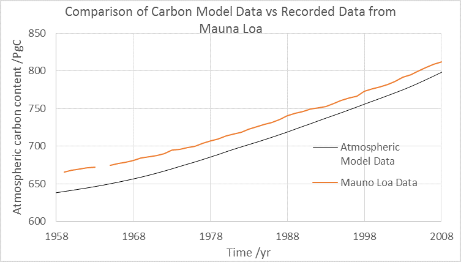
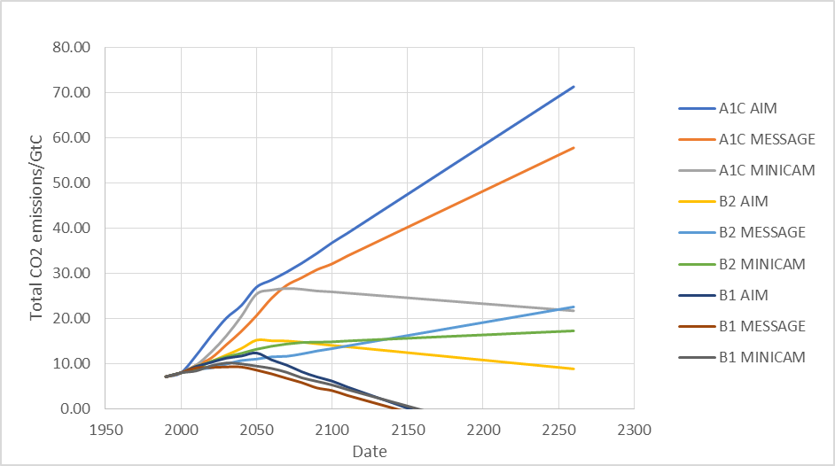
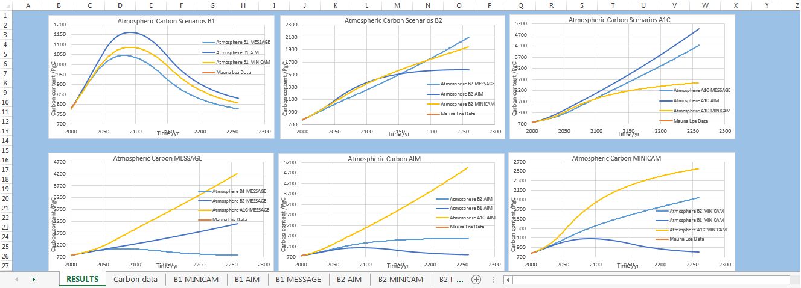

```{r setup, include=FALSE}
knitr::opts_chunk$set(echo = TRUE,cache=TRUE)
```
  
  
<br/>   
  
A model delineating the interactions between atmospheric, surface and deep ocean (ASD) carbon reservoirs was produced; the amount of carbon in any reservoir changes as a function of time and was modelled numerically using differential equations. 
Three equations were developed describing changes in atmospheric $(\dot M_a)$, surface ocean $(\dot M_s)$ and deep ocean $(\dot M_d)$  carbon.

 <br/>
  
$\dot M ̇_a=-k_{sa} M_a+k_{as} M_s+F(t)$  

$\dot M ̇_s=k_{sa} M_a+k_{sd} M_d-k_{as} M_s-k_{ds} M_s$  

$\dot M ̇_d=k_{ds} M_s-k_{sd} M_d$  


 <br/>  
  
  
The model was calibrated using atmospheric CO2 hindcast data, this allowed for known historical values to be compared to the carbon model. 
A graph was plotted of the carbon model’s atmospheric carbon content against the Mauna Loa data; there was a large discrepancy between each data trend, approximately 90 pgC in 1988.

The discrepancy was found to be a result of the carbon model not accounting for the change in surface ocean pH levels as its carbon content increases. This was accounted for in the model by introducing the Revelle factor to two of the differential equations thus creating a Bolin-ASD model. The equations were:   
  
<br/>  
  
$\frac{dM_a}{dt}=k_{as} M_s+Rk_{as} (M_s-m_s)-k_{sa} M_a+F(t)$  

$\frac{dM_s}{dt}=k_{sa} M_a+k_{sd} M_d-k_{as} m_s+Rk_{as} (M_s-m_s )-k_{ds} M_s$   

  
<br/>

   
```{r , out.width = '100%',echo=FALSE}
```  
  
    
  
    


<br/>
  
The Bolin-ASD model data agreed with the hindcast data – with only a 20 pgC discrepancy in 1983. The model effectively described a pre-industrial steady state.

  
After successful hindcasting the model was ready for input; this was provided as a range of future scenarios - The model was used to forecast a family of scenarios taken from the IPCC special report on emissions scenarios (SRES) ; three scenarios were selected describing high, medium and low carbon production groups, projections of climate change are contingent upon future anthropogenic action, the model interpreted the economic, political and environmental implications of the A1C,B2, B3 scenarios along with the AIM, MESSAGE and MiniCAM modelling approaches. (Appendix A)
In the B1 low-medium low emissions scenario, it showed good agreement across the three modelling approaches, atmospheric carbon content peaked around 2090 decreasing exponentially after this with a state of zero carbon emissions being met in 2150.

In the B2 medium-low/high scenario, each approach increased linearly until 2050.
In the AIM model a steady state was reached in 2250; in each case the CO2 content in 250 years was at least three times higher than today ranging from 1583 – 2043 pgC.

In the A1C fossil fuel intensive scenario, by 2250 projected atmospheric CO2 for AIM, MiniCAM and MESSAGE were 4779 pgC, 2533 pgC and 4073 pgC respectively – ranging between a threefold and fivefold increase.
Although our model included the most significant carbon reservoirs, it omitted other real-world elements such as marine biota interaction within the surface ocean, sediment deposit within the deep ocean and weathering within the atmosphere. Our model will not have perfect parity with historical data; future models should aim to incorporate these reservoirs to more accurately describe reality.

The ASD model, described by the system of differential equations were found, using the eigenvalue method and computer algebra package to have an exact solution -  

<br/>


  
  
Apendix A
  
   
  
<br />
  
  
      
  
  
  
  

  
******
